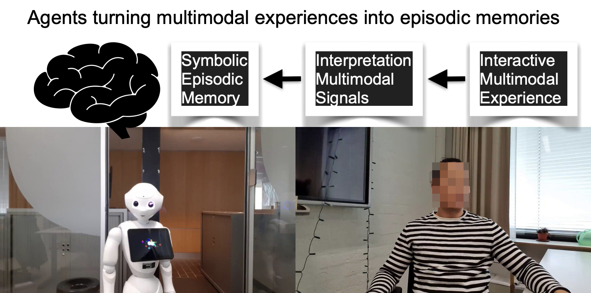
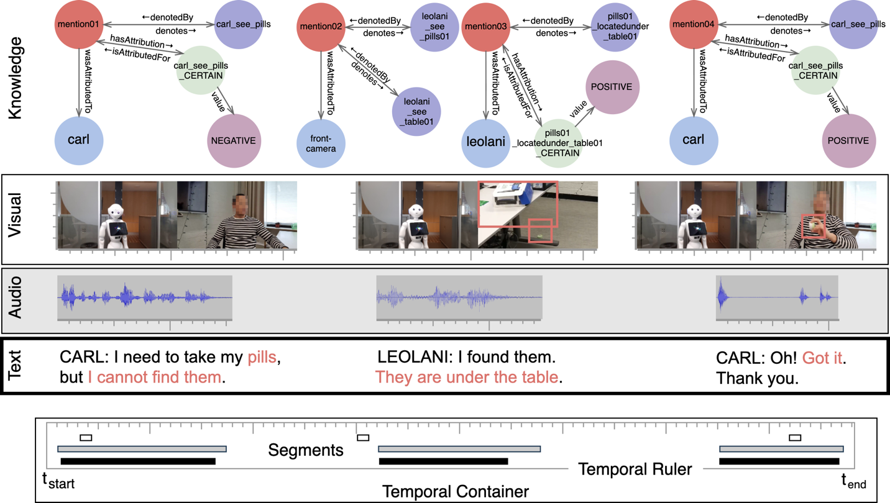

# cltl-chatbots

[UNDER CONSTRUCTION]
Series of chatbots that demonstrate Leolani’s functionalities.

The chatbots use the CLTL EMISSOR and KnowledgeRepresentation (aka the BRAIN) models and follow the Leolani platform in
which signals are processed and generated as a stream in time. The interpretation of the signals is stored in the BRAIN,
where knowledge cumulates. Reasoning over this knowledge (aka THOUGHTS), triggers to responses of the system to changes
in the BRAIN as a result of input signal interpretations.



The interaction with a user is recorded by EMISSOR as signals in a scenario with a timeline. EMISSOR can record audio,
text and images. The BRAIN is a triple store that records the interpretation and cumulated knowledge but also the
perspective of the users.



Several Jupyter notebooks have been included that demonstrate different types of interactions.
[NOTEBOOKS ARE OUT DATED AND NEED TO BE REVISED]

## Getting started

Before starting install GraphDB and launch it with a sandbox repository, which will act as a brain. A free version of
GraphDB can be donwloaded and installed from:

https://graphdb.ontotext.com

After installing GraphDB you need to launch and create a repository with the name `sandbox`. This repository will be
used as the BRAIN.

Furthermore, some of the application use docker repositories for sensor data processing suc as face and object detection.
For this, you need to install Docker desktop.  You can follow the instructions on this page: https://www.docker.com/products/docker-desktop

After installing docker desktop, we advise you to pull the docker images for sensor processing before you start. The images are rather big.
Use the docker pull command from the command line:

* docker pull tae898/yolov5 (15.84GB): object detection
* docker pull tae898/age-gender (4.96GB): face properties
* docker pull tae898/face-detection-recognition (2.9GB): face identitification

Once the docker images are loaded and running in your Docker desktop they are available to make calls from the notebooks and other code.


## Installing

In order to install the packages you should do the following from the terminal:

<ol>
<li> Clone this repo and do the following commands from the terminal:

``` python
git clone git@github.com:leolani/cltl-chatbots.git
```

<li> "cd" to clt-chatbots where the code is cloned and create a virtual environment within your cloned folder for
   installing all required packages and modules. 
   
``` python
cd cltl-chatbots
```
   
If you do not have virtualenv for Python installed, install virtualenv for Python:

``` python
pip install --user virtualenv
```

Then you can create and activate your virtual environment called `venv` :

``` python
python -m venv venv
source venv/bin/activate
```

<li> We need to make the virtual environment `venv` known to Jupyter notebooks. For this do the following:

``` python
pip install ipykernel
python -m ipykernel install --user --name=venv
```

<li> Now we are ready to install the main packages `emissor` and the `brain` and al other dependent packages:

``` python
pip install --upgrade pip
pip install -r requirements.txt
```

<li> [OPTIONAL] Some notebooks use spaCy. Download the appropriate language model for spaCy before starting within the
   `venv`:

``` python
python -m spacy download en_core_web_sm
```
</ol>

When there are no error messages you can launch jupyter to load the notebooks.

## Running the notebooks:

Start jupyter and select the kernel `venv`

``` python
jupyter lab
```
Select kernel venv for each notebook

## Troubling shooting
The code has been developed and tested on Mac OS and Linux. Some issues may arise when installing and running on Windows 10.
You can consult the trouble shooting document for solutions: [TROUBLESHOOTING.md]<TROUBLESHOOTING.md>

The best way to find and solve your problems is to see in the github issue tab. If you can't find what you want, feel free to raise an issue. We are pretty responsive.

## Contributing

Contributions are what make the open source community such an amazing place to be learn, inspire, and create. Any contributions you make are **greatly appreciated**.

1. Fork the Project
2. Create your Feature Branch (`git checkout -b feature/AmazingFeature`)
3. Commit your Changes (`git commit -m 'Add some AmazingFeature'`)
4. Push to the Branch (`git push origin feature/AmazingFeature`)
5. Open a Pull Request

## References

When using this code please make reference to the following papers:

```bibtex
@article{santamaria2021emissor, title={EMISSOR: A platform for capturing multimodal interactions as Episodic Memories
and Interpretations with Situated Scenario-based Ontological References}, author={Santamar{\'\i}a, Selene B{\'a}ez and
Baier, Thomas and Kim, Taewoon and Krause, Lea and Kruijt, Jaap and Vossen, Piek}, booktitle={Processings of the MMSR
workshop "Beyond Language: Multimodal Semantic Representations", IWSC2021, also available as arXiv preprint arXiv:
2105.08388}, year={2021} }

@inproceedings{vossen2019modelling, title={Modelling context awareness for a situated semantic agent}, author={Vossen,
Piek and Baj{\v{c}}eti{\'c}, Lenka and Baez, Selene and Ba{\v{s}}i{\'c}, Suzana and Kraaijeveld, Bram},
booktitle={International and Interdisciplinary Conference on Modeling and Using Context}, pages={238--252}, year={2019},
organization={Springer} }

@inproceedings{vossen2019leolani,
  title={Leolani: A robot that communicates and learns about the shared world},
  author={Vossen, Piek and Baez, Selene and Bajcetic, Lenka and Basic, Suzana and Kraaijeveld, Bram},
  booktitle={2019 ISWC Satellite Tracks (Posters and Demonstrations, Industry, and Outrageous Ideas), ISWC 2019-Satellites},
  pages={181--184},
  year={2019},
  organization={CEUR-WS}
}
```
